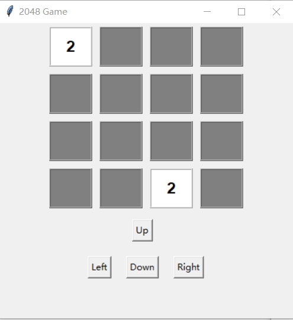
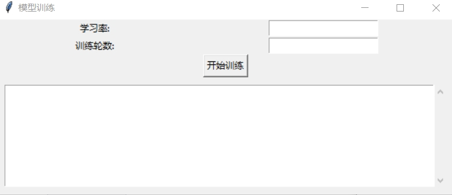

[切换到中文版本](README_zh.md) 

[Switch to English Version](README.md)


# 2048AI-Mastermind

2048AI-Mastermind is a solution specifically designed to tackle the 2048 game. It analyzes the current state of the 2048 game to recommend the best next move direction, helping players achieve better scores in the game.

## Installation

1. Make sure you have Python 3.11 installed.
2. Install the required dependencies using the following command:
   ```
   pip install -r requirements.txt
   ```

## Usage
### Playing the Game to Gain Experience
Execute the following command to play the 2048 game and gain experience:

```
python play_ui.py
```

We provide a graphical game interface where you can play by clicking interface buttons or using the "up, down, left, right" keys on your keyboard:  


### Training the Model

To train the model, execute the following command:
```
python train_ui.py
```

We provide a graphical training interface:


### Resuming Training from a Checkpoint

If you need to resume training from a checkpoint, add the following code inside the `train_model_from_file` function in the `train_ui.py` file:
```python
model = load_model(model_checkpoint_path)
```

### Performing Inference

To perform inference testing, execute the following command:
```
python predict.py
```

By following these steps, you can easily install, train the model, and use this solution to optimize your performance in the 2048 game.
