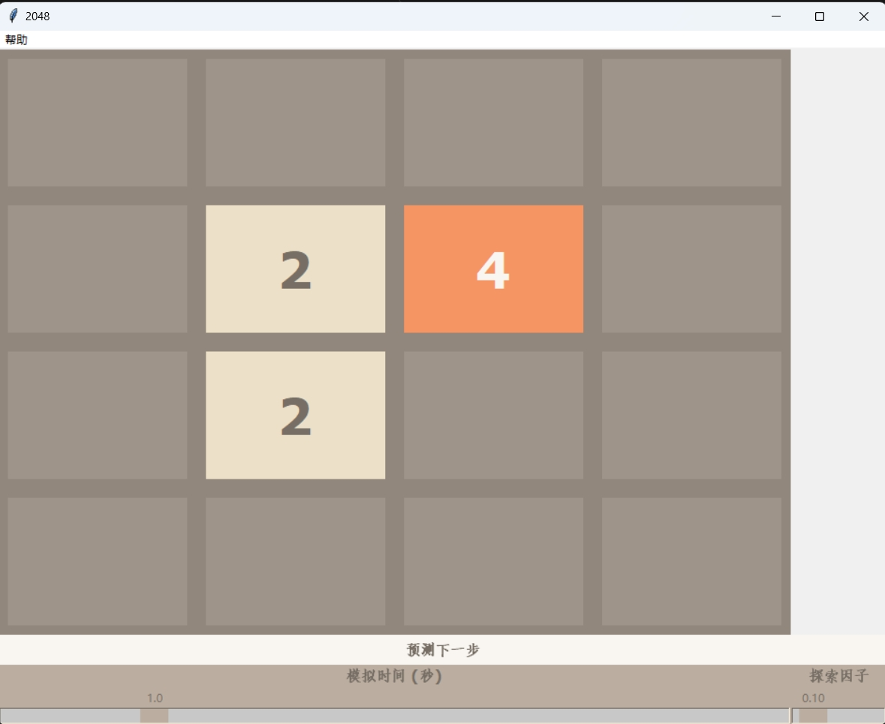

[切换到英文版本](README.md)  
[Switch to English Version](README.md)

# 2048AI-Mastermind

2048AI-Mastermind 是一个专门为解决 2048 游戏而设计的解决方案。它通过分析当前 2048 游戏的状态，从而推荐出最佳的下一步移动方向，帮助玩家在游戏中取得更好的成绩。

## 安装

1. 确保您已安装 Python 3.11 版本。
2. 使用以下命令安装所需的依赖：
   ```bash
   pip install -r requirements.txt
   ```

## 使用方法

### 运行界面

要启动 `2048AI-Mastermind` 界面，请执行以下命令：
```python
python puzzle.py
```

这将会打开一个窗口，显示 2048 游戏的界面。在这个界面上，你可以通过键盘的方向键或相应的快捷键来控制游戏。

以下是游戏界面的截图示例：  



### 控制游戏

- **点击输入**：通过点击格子可以输入数字。
- **方向键**：`上、下、左、右` 键分别对应向上、向下、向左、向右移动。


### 预测下一步

你还可以点击界面上的“预测下一步”按钮来让 AI 建议最佳移动方向。这将显示 AI 根据当前游戏状态所推荐的最佳移动方向。

---

### 调整参数

- **模拟时间**：调整模拟时间以优化 AI 的决策精度。模拟时间越长，AI 进行的模拟次数越多，决策也越准确。
- **探索因子**：调整探索因子以控制 AI 的探索程度。探索因子越大，AI 更倾向于探索未知的路径；反之则倾向于选择当前已知的最佳路径。

#### 检查参数说明

- 点击菜单栏中的“帮助” -> “参数说明”，可以查看有关模拟时间和探索因子的详细说明。

### 参数效果说明

以下是模拟时间为 0.5 秒时，AI 达成不同目标的概率：

| 目标分数        | 达成概率 |
|----------------|----------|
| 512 及以上      | 97%      |
| 1024 及以上     | 93%      |
| 2048           | 60%      |

#### 退出游戏

- 按下 `Esc` 键或者点击窗口右上角的关闭按钮均可退出游戏。

## 参考项目

本项目参考了以下开源项目：[https://github.com/TwoPoint0200/2048-Python-AI](https://github.com/TwoPoint0200/2048-Python-AI)  